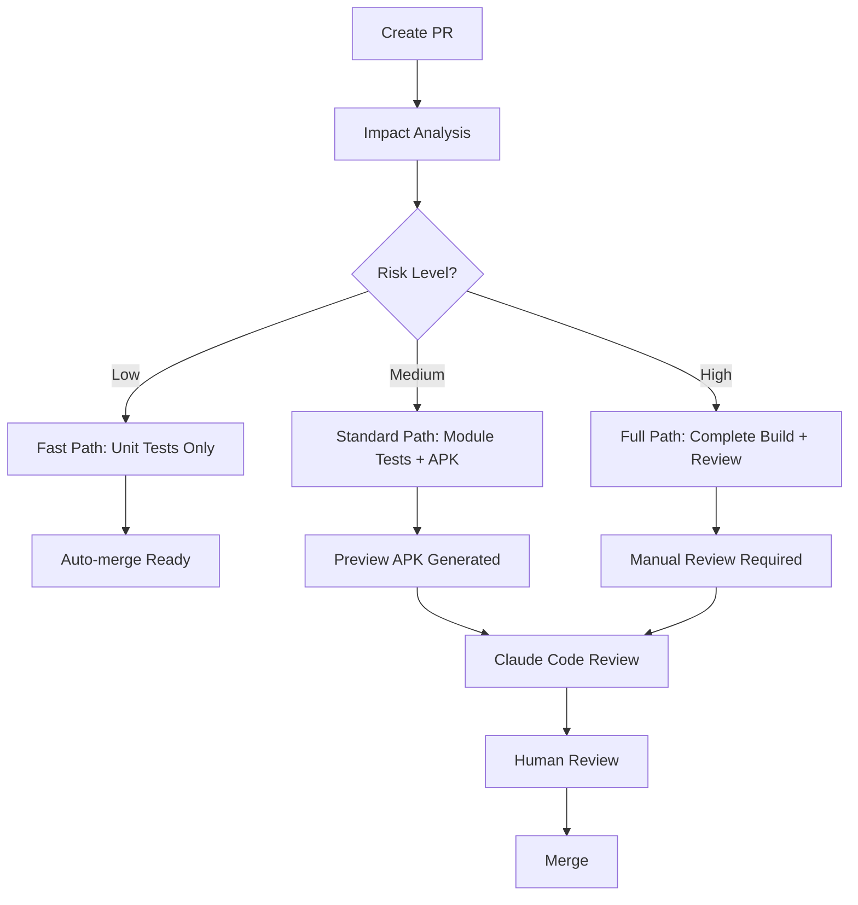

# PR Developer Experience Guide

This document outlines the enhanced pull request workflow for Kelime İşlem, designed to maximize developer productivity while maintaining high code quality.

## 🚀 Quick Start

1. **Create a PR** using our [comprehensive template](../.github/pull_request_template.md)
2. **Automatic checks** run based on impact analysis
3. **Preview APK** is built and distributed automatically  
4. **Claude Code review** provides automated feedback
5. **Human reviewers** are notified via CODEOWNERS

## 🔄 PR Workflow Overview



## 🎯 Automatic Impact Analysis

Our smart impact analysis determines the optimal CI strategy:

### Risk Levels

**🟢 Low Risk** - Documentation, tests, minor fixes
- **Tests:** Affected modules only
- **Build:** Compilation check
- **Review:** Claude Code + 1 human reviewer

**🟡 Medium Risk** - UI changes, new features
- **Tests:** Full module test suite
- **Build:** Debug APK + preview distribution
- **Review:** Claude Code + architectural review

**🔴 High Risk** - Domain logic, shared code, build system
- **Tests:** Full test suite across all modules
- **Build:** Complete build with all variants
- **Review:** Claude Code + thorough human review + architecture validation

### Module Detection

The system automatically detects changes in:

- `:app` - Android application layer
- `:core:*` - Core business logic, UI, data layers  
- `:shared` - Multiplatform shared code
- `:feature:*` - Feature modules
- `build-logic/` - Build system and conventions

## 📱 Preview APK Distribution

Every PR automatically generates a preview APK:

### Features
- **Automatic builds** for all non-draft PRs
- **Smart commenting** with download links and build info
- **Size tracking** and performance monitoring
- **7-day retention** with automatic cleanup

### Usage
1. APK is built automatically on PR creation/update
2. Download link is posted as PR comment
3. Install on device using "Install unknown apps"
4. Test changes and report feedback in PR

### Firebase Integration (Optional)
```yaml
# Uncomment in pr-preview.yml to enable Firebase App Distribution
- name: Distribute to Firebase App Distribution
  uses: wzieba/Firebase-Distribution-Github-Action@v1
  with:
    appId: ${{ secrets.FIREBASE_APP_ID }}
    serviceCredentialsFileContent: ${{ secrets.FIREBASE_SERVICE_ACCOUNT_JSON }}
    groups: testers
```

## 🏗️ Build Optimization

### Gradle Performance
Our optimized Gradle configuration includes:

```properties
# gradle.properties
org.gradle.caching=true              # Remote build cache
org.gradle.parallel=true             # Parallel execution
org.gradle.configureondemand=true    # Configuration on demand
org.gradle.configuration-cache=true  # Configuration caching
```

### CI Caching Strategy
- **Gradle dependencies** cached across runs
- **Android SDK** cached for faster setup
- **Build outputs** cached with remote build cache
- **Test results** cached to skip unchanged tests

### Performance Benefits
- **~60% faster** CI builds with warm cache
- **Parallel execution** of independent modules
- **Smart test selection** based on changed code
- **Incremental builds** in development

## 👥 Code Ownership & Reviews

### CODEOWNERS Configuration
Automatic reviewer assignment based on changed files:

```bash
# Core architecture requires domain expert review
/core/domain/           @erdalgunes
/core/data/             @erdalgunes

# Build system changes need build expert
/build-logic/           @erdalgunes
gradle.properties       @erdalgunes

# Circuit architecture patterns
**/*Presenter.kt        @erdalgunes
**/*Screen.kt           @erdalgunes
```

### Review Requirements
- **Minimum 1 reviewer** for all changes
- **Domain experts** automatically assigned for core changes  
- **Architecture review** required for Circuit pattern changes
- **Security review** for sensitive areas (auth, data, networking)

## 🤖 Automated Quality Gates

### Claude Code Integration
- **Automatic review** on every PR
- **Smart labeling** based on analysis:
  - `claude-approved` - Ready for human review
  - `needs-human-review` - Complex issues found
  - `security-concern` - Security issues detected
  - `performance-issue` - Performance problems identified

### SonarCloud Quality Gates
- **80% minimum coverage** for all new code
- **No critical security vulnerabilities**
- **Technical debt ratio** below threshold
- **Code duplication** below 5%

### Test Requirements
- **Unit tests** for all business logic (Circuit Presenters)
- **80% overall coverage** maintained
- **Kotest property-based tests** for complex algorithms
- **UI tests** planned with Paparazzi integration

## ⚡ Performance Optimizations

### Fast Feedback Loop
1. **Impact analysis** completes in ~10s
2. **Scoped tests** run only for affected modules
3. **Parallel execution** across multiple workers
4. **Incremental compilation** with Kotlin compiler

### Build Cache Strategy
```yaml
# GitHub Actions caching
- name: Cache Gradle dependencies
  uses: actions/cache@v3
  with:
    path: |
      ~/.gradle/caches
      ~/.gradle/wrapper
      ~/.gradle/jdks
    key: gradle-${{ runner.os }}-${{ hashFiles('**/*.gradle*') }}
```

### Resource Optimization
- **2 parallel workers** for optimal resource usage
- **Gradle daemon disabled** in CI for memory efficiency  
- **Configuration cache** for faster configuration phase
- **Build scan publishing** for performance insights

## 🛠️ Developer Tools Integration

### Local Development
```bash
# Run impact analysis locally
.github/scripts/impact-analysis.sh

# Run affected tests only
./gradlew $(cat affected-modules.txt):test

# Generate coverage report
./gradlew koverHtmlReport
```

### IDE Integration
- **Detekt** integration with IDE warnings
- **Kotlin** code formatting on save
- **Test coverage** visualization in IDE
- **Circuit architecture** live templates

## 📊 Metrics & Monitoring

### PR Metrics Tracked
- **Time to first review** (target: < 4 hours)
- **Time to merge** (target: < 24 hours for low risk)
- **Review iteration count** (target: < 3 cycles)
- **Build success rate** (target: > 95%)

### Quality Metrics
- **Test coverage trend** (target: maintain 80%+)
- **Technical debt ratio** (target: < 5%)
- **Security vulnerability count** (target: 0 critical)
- **Performance regression detection**

## 🚨 Troubleshooting

### Common Issues

**Build Failures:**
- Check Gradle version compatibility
- Verify Android SDK installation
- Clear Gradle cache: `./gradlew clean --build-cache`

**Test Failures:**
- Run affected tests locally first
- Check for flaky tests in CI logs
- Verify test data isolation

**Coverage Drops:**
- Add tests for new code paths
- Exclude UI components appropriately
- Verify Kover configuration

**APK Distribution Issues:**
- Check artifact upload logs
- Verify APK build success
- Ensure proper permissions for distribution

### Getting Help

1. **Check workflow logs** in GitHub Actions
2. **Review Detekt/SonarCloud** reports for specific issues
3. **Ask in PR comments** for architectural guidance
4. **Use `@claude`** for automated assistance

## 🎯 Best Practices

### PR Creation
- **Keep PRs small** (< 400 lines preferred)
- **Single responsibility** per PR
- **Descriptive titles** with context
- **Complete template** information

### Code Quality
- **Circuit architecture** boundaries respected
- **Business logic** separated from UI
- **Error handling** implemented consistently
- **Performance impact** considered

### Testing Strategy
- **Test business logic** thoroughly
- **Mock external dependencies**
- **Property-based testing** for edge cases
- **UI testing** with Paparazzi (planned)

### Review Etiquette
- **Timely reviews** within 4 hours
- **Constructive feedback** with suggestions
- **Architectural guidance** when needed
- **Approval** only when confident

## 🔮 Future Enhancements

### Planned Improvements
- **Firebase App Distribution** integration
- **Paparazzi UI testing** pipeline
- **Performance regression** detection
- **Auto-merge** for low-risk PRs

### Experimental Features
- **AI-powered** test generation
- **Visual regression** testing
- **Accessibility** automation
- **Bundle size** tracking

---

*This workflow is continuously evolving based on team feedback and industry best practices. Suggest improvements via PR or issue.*